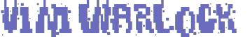
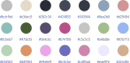

<div align="center">
  <div>
    
  </div>
  <p></p>
  <div>
    
    <a href="https://luarocks.org/modules/misanthropicbit/warlock.nvim">
        
    </a>
    <a href="/LICENSE">
        
    </a>
  </div>
  <br />
  <div>
    
  </div>
</div>

---

## Install

Install via `git` or use your favorite plugin manager.

```bash

```

Please see the [docs](docs/warlock.nvim.txt) for configuration.

## Configuration

```lua
require("warlock").configure({
    overrides = {
        -- User overrides
    }
})
```

## Screenshots
